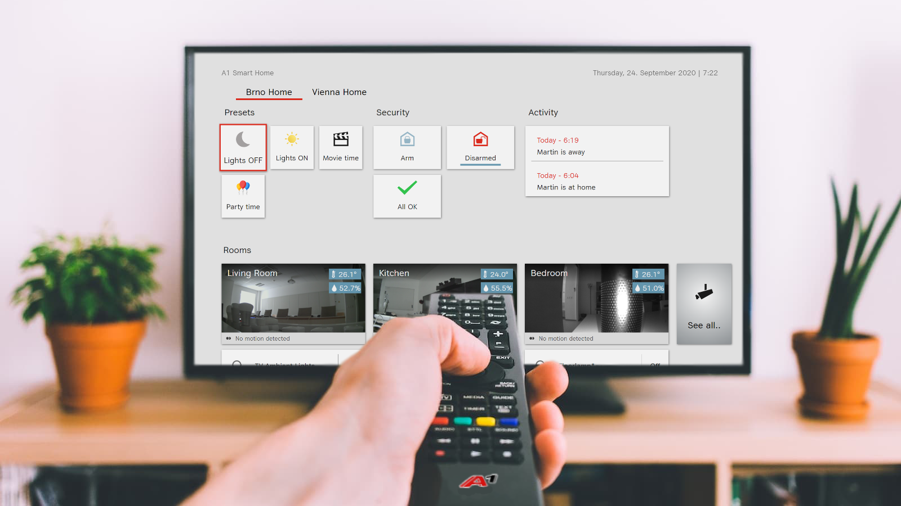

# A1 TV Dashboard



## Available Scripts

In the project directory, you can run:

### `npm start`

Runs the app in the development mode.<br />
Open [http://localhost:3000](http://localhost:3000) to view it in the browser.

The page will reload if you make edits.<br />
You will also see any lint errors in the console.

### `npm test`

Launches the test runner in the interactive watch mode.<br />
See the section about [running tests](https://facebook.github.io/create-react-app/docs/running-tests) for more information.

### `npm run build`

Builds the app for production to the `build` folder.<br />
It correctly bundles React in production mode and optimizes the build for the best performance.

The build is minified and the filenames include the hashes.<br />
Your app is ready to be deployed!

See the section about [deployment](https://facebook.github.io/create-react-app/docs/deployment) for more information.


# Service Discovery
When the TV Dashboard is launched, the application is automatically registered to Zeroconf/Avahi service discovery system. Conversely, when the application is closed, the service is unregistered. The service is registered as *TV Dashboard* on port *58000* with the type *_http._tcp*.

## Service Registration format

```
 [POST] http://zeroconf:15051/a1/xploretv/v1/zeroconf
```

```json {cmd=node .line-numbers}
{
   "name":"TV Dashboard",
   "replaceWildcards":true,
   "serviceProtocol":"any",
   "service":{
      "type":"_http._tcp",
      "port":58000,
      "txtRecord":{
         "version":"1.0",
         "provider":"A1 Telekom Austria",
         "product":"Xplore TV-Dashboard"
         "path":"/",
         "virtualHost":true
      }
   }
}
```

## Service Deregistration

```
[POST/DELETE] https://zerodiscovery.duckdns.org:15051/a1/xploretv/v1/zeroconf/TV Dashboard
```

## Service Response

```
[GET] https://zerodiscovery.duckdns.org:15051/a1/xploretv/v1/zeroconf
```

```json
[
    {...},
    {
        "name":"TV Dashboard at zerodiscovery",
        "hostName":"zerodiscovery.local.",
        "domainName":"local",
        "addresses":{
        "ipv4":[
            "127.0.0.1"
        ],
        "ipv6":[]
        },
        "service":{
            "type":"_http._tcp.local.",
            "port":58000,
            "txtRecord":{
                "version":"1.0",
                "provider":"A1 Telekom Austria",
                "product":"Xplore TV-Dashboard"
                "path":"/",
                "virtualHost":true
            }
        }
    },
    {...}
]
```

# File Server Deployment - Raspberry PI

The folder *scripts* contains automatic installation scripts for Raspberry Pi and OpenWrt devices. Notably, the raspberry script applies only to *Debian-based* systems. Finally, the TV Dashboard can be accessed on address *http://{hostname/device_ip}/>:58000* within the local area network.<br />

## Intallation Steps

1. Clone git repository *git clone https://github.com/mqtt2go/tv-dashboard.git*.
2. Switch to *<repository>/scripts/raspberry* folder.
3. Change installation script permissions *chmod 755 install.sh*.
4. Launch installation script as root user *sudo ./install.sh*.

# File Server Deployment - OpenWRT

The installation on OpenWrt devices requires additional prerequisites. Before the actual installation, the LXC container named *fileserver* must be present in the system. Then the installation process follows the same steps. ONce installed , the TV Dashboard can be accessed on address *http://tvdashboard:58000*.

## Installation Steps
1. Install *fileserver* LXC container vi web user interface.
2. Connect via SSH to the OpenWRT device.
3. Attach to the LXC by emmitting *lxc-attach -n fileserver*
4. Clone git repository *git clone https://github.com/mqtt2go/tv-dashboard.git*.
5. Switch to *<repository>/scripts/openwrt* folder.
6. Change installation script permissions *chmod 755 install-owrt.sh*.
7. Launch installation script as root user *sudo ./install-owrt.sh*.

# Kiosk Mode Installation

For the Raspberry Pi kiosk mode installation, following parts are needed:

 1. Raspberry Pi 3B or higher (to ensure quality experience from the chrome browser).
 2. MicroSD card big enough to store current version of Raspberry Pi OS Lite (currently 4GB minimum)
 3. Kiosk installation script provided in this repo.

## Installation steps

1.  Install Raspberry Pi OS Lite to the microSD card. This can be done utilizing the Raspberry Pi Imager software.
2.  Copy the installation script to the micdoSD card – ideally via ssh to booted systems’ home directory and run it as sudo.
3.  Wait for the script to finish and then reboot the device.

Optionally a custom modification to the RPi can be done – changing usernames and logins to enhance security etc. If the sole purpose of Kiosk Mode installation is only to verify the functionality, this can be omitted. In all other scenarios we strongly recommend securing the device.